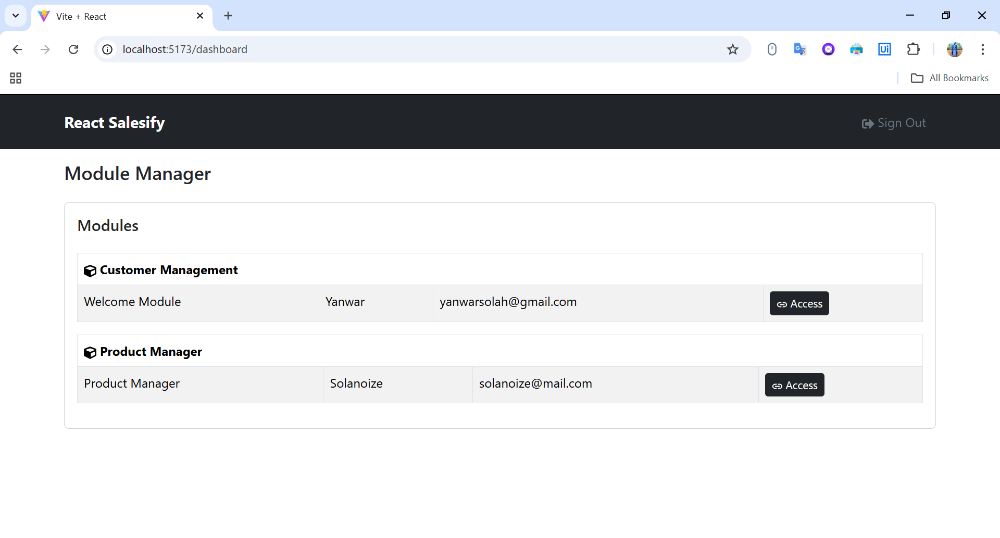
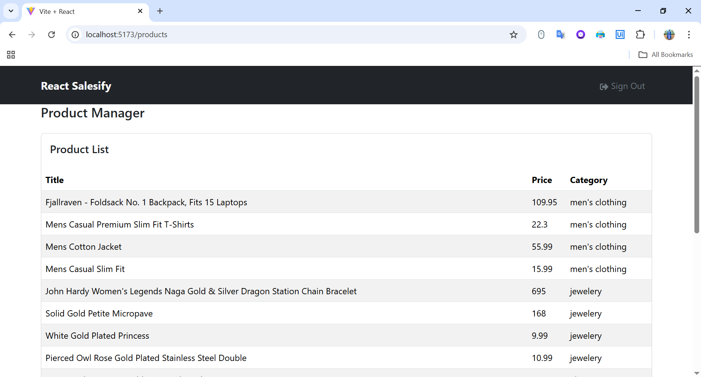

# React Salesify

A modular and pluggable sales information system built with React. Designed with a core library architecture providing ready-to-use features like routing, state management, authentication, and data handling. Easily extendable through independent modules without affecting the core system.

## ✅ Key Features:

- **Modular Architecture:**
  - Each module is separated into its own directory with independent configurations, pages, layouts, and widgets.
  - Modules can be dynamically loaded using _lazy loading_ to enhance performance.
- **Pluggable System:**
  - Modules can be added or removed without affecting other modules.
  - Suitable for large-scale applications that require incremental feature development.
- **Core Libraries:**
  - Routing, state management, and utility functions are provided in the core to ensure consistency and ease of development.
- **Widget System:**
  - Reusable widgets can be used across various modules.

## Running the Project

Ensure the backend API is downloaded and running, as this project requires an API from the backend.

Clone this project and install the required dependencies:

```bash
git clone https://github.com/solanoize/react-salesify
cd react-salesify
npm install
```

Create a `.env.local` file and fill it with:

```
VITE_BASE_URL=http://localhost:8000
VITE_BRAND_NAME="React SISFO Penjualan"
```

Then, run the project:

```
npm run dev
```

Access the URL `http://localhost:5173/`. Make sure we already have credentials or an account on the backend.

## MIT License

```
Copyright (c) 2025 Solanoize

Permission is hereby granted, free of charge, to any person obtaining a copy
of this software and associated documentation files (the "Software"), to deal
in the Software without restriction, including without limitation the rights
to use, copy, modify, merge, publish, distribute, sublicense, and/or sell
copies of the Software, and to permit persons to whom the Software is
furnished to do so, subject to the following conditions:

The above copyright notice and this permission notice shall be included in all
copies or substantial portions of the Software.

THE SOFTWARE IS PROVIDED "AS IS", WITHOUT WARRANTY OF ANY KIND, EXPRESS OR
IMPLIED, INCLUDING BUT NOT LIMITED TO THE WARRANTIES OF MERCHANTABILITY,
FITNESS FOR A PARTICULAR PURPOSE AND NONINFRINGEMENT. IN NO EVENT SHALL THE
AUTHORS OR COPYRIGHT HOLDERS BE LIABLE FOR ANY CLAIM, DAMAGES OR OTHER
LIABILITY, WHETHER IN AN ACTION OF CONTRACT, TORT OR OTHERWISE, ARISING FROM,
OUT OF OR IN CONNECTION WITH THE SOFTWARE OR THE USE OR OTHER DEALINGS IN THE
SOFTWARE.
```

## Creating a Module (Plugins)

Create a new directory, for example, `products` inside the `src/modules` folder.

Within the `products` module, create the directory and file structure as follows:

```bash
products/
│   index.js
│   module.json
├───config
│     index.js
├───hooks
│     index.js
├───layouts
│     index.js
├───pages
│     index.js
└───widgets
      index.js
```

### Setting up `module.json`

Open the `module.json` file and add:

```json
{
  "id": "products",
  "title": "Product Manager",
  "author": "Solanoize",
  "email": "solanoize@mail.com",
  "category": "Product Manager"
}
```

> `id` must not contain spaces and should be all lowercase since it will be used as a path.

### Creating Hooks

Create a hook called `useProduct.js` inside the `hooks` directory and add the following code:

```js
import { useState } from "react";
import { useHttp } from "../../../core";

export default function useProduct() {
  const http = useHttp();
  const [products, setProducts] = useState([]);

  const list = async () => {
    try {
      const url = "https://fakestoreapi.com/products";
      const response = await http.get(url);
      setProducts(response.data);
    } catch (error) {
      alert(error.message);
    }
  };

  return {
    models: products,
    list,
  };
}
```

Then, open the `hooks/index.js` file (still within the same directory) and export the hook you just created:

```js
export { default as useProduct } from "./useProduct";
```

### Creating a Layout

Create a layout called `ProductLayout.jsx` inside the `layouts` directory and add the following code:

```jsx
import { Outlet } from "react-router-dom";
import { WidgetBanner, WidgetGuard } from "../../../core";

export default function ProductLayout() {
  return (
    <>
      <WidgetBanner />
      <WidgetGuard>
        <Outlet />
      </WidgetGuard>
    </>
  );
}
```

`WidgetGuard` is used to protect all pages of the `products` module that uses this layout.

Then, export the layout in `index.js`:

```js
export { default as ProductLayout } from "./ProductLayout";
```

### Creating the Product List Page

Create a page for displaying the product list called `ProductPageList.jsx` inside the `pages` folder and add the following code:

```jsx
import { Card, Col, Container, Row, Table } from "react-bootstrap";
import { useEffect } from "react";
import { WidgetTitle } from "../../../core";
import { useProduct } from "../hooks";

export default function ProductPageList() {
  const product = useProduct();

  useEffect(() => {
    product.list();
  }, []);

  return (
    <Container>
      <WidgetTitle title={"Product Manager"} />
      <Row>
        <Col>
          <Card>
            <Card.Body>
              <Card.Title>Product List</Card.Title>
            </Card.Body>
            <Table hover striped>
              <thead>
                <tr>
                  <th>Title</th>
                  <th>Price</th>
                  <th>Category</th>
                </tr>
              </thead>
              <tbody>
                {product.models.map((value) => (
                  <tr key={value.id}>
                    <td>{value.title}</td>
                    <td>{value.price}</td>
                    <td>{value.category}</td>
                  </tr>
                ))}
              </tbody>
            </Table>
          </Card>
        </Col>
      </Row>
    </Container>
  );
}
```

Add the page to the `index.js`:

```js
export { default as ProductPageList } from "./ProductPageList";
```

### Creating the Configuration

Create a configuration file for our module so it can be read and accessed by the system. Create a file called `ProductConfig.jsx` inside the `config` directory and add the following configuration:

```js
import module from "../module.json";
import { ProductLayout } from "../layouts";
import { ProductPageList } from "../pages";

export default {
  ...module,
  router: {
    layout: {
      path: module.id,
      element: <ProductLayout />,
    },
    childs: {
      productPageList: {
        index: true,
        element: <ProductPageList />,
      },
    },
  },
};
```

Add the configuration to `index.js`:

```js
export { default as ProductConfig } from "./ProductConfig";
```

### Register Everything in the Module `index.js`

Add `config`, `hooks`, `layouts`, and `pages` to the root module `index.js`:

```js
export * from "./config";
export * from "./hooks";
export * from "./layouts";
export * from "./pages";
```

## Registering the Module to the Registry

Open the `config` file outside your module, located in `src`, and open `registry.js`. Add the product module configuration you created:

```js
import { WelcomeConfig } from "../extras";
import { ProductConfig } from "../modules/products";

export const moduleRegistry = {
  WelcomeConfig,
  ProductConfig,
};
```

Run the application and sign in with the credentials you already have. On the Dashboard page, your module should appear.



If we click the **Access** button, we will be automatically redirected to our module page:


